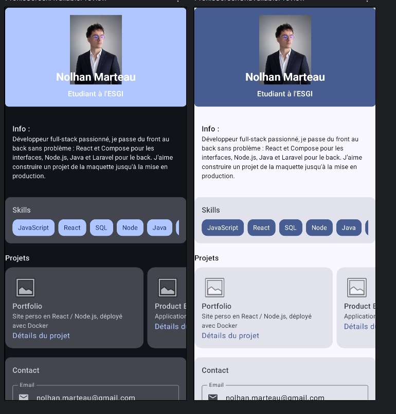
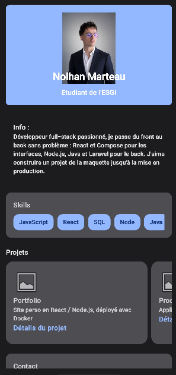
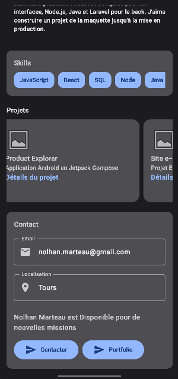

# Profil Développeur v3.0.0

## Description

C'est une petite application Android faite avec Jetpack Compose qui affiche mon profil de développeur.
On y trouve ma photo, mon nom, une courte description, mes compétences, quelques projets et une partie contact.

- **v1** : Première version, avec le nom, la description et les compétences. Elle a servi à prendre en main Android Studio et le développement mobile.
- **v2** : Interface améliorée, et ajout des projets et de la section contact.
- **v3** : Application interactive, avec la recherche de projets, les favoris, le filtre « favoris uniquement », le compteur de projets et l'affichage du contact au clic. L'état est géré par un ViewModel avec StateFlow.

## États gérés par l'application

L'état principal de l'écran est regroupé dans `ProfileUiState`, géré par le `ProfileViewModel` :

- **Texte de recherche** (`searchQuery`) : ce que l'utilisateur tape pour filtrer les projets.
- **Filtre favoris** (`showOnlyFavorites`) : affiche tous les projets ou seulement les favoris.
- **Projets favoris** (`favoriteProjectIds`) : les identifiants des projets marqués comme favoris.
- **Liste affichée** (`projects`) : les projets visibles, recalculés à partir de la recherche et du filtre

## État Local

# Quel état avez-vous conservé directement dans un composable et pourquoi ?

- **Affichage du contact** (`showContact`) : affiche ou masque les informations de contact.

On a gardé l'affichage du contact dans un composable car il ne change aucune donnée, il n'a aucun lien avec le ViewModel.

## State Hoisting

# Pourquoi votre composable d'écran principal peut-il être considéré comme stateless ?

Il peut être considéré comme stateless car il affiche uniquement des informations que le container lui transmet, il se contente 
d'afficher sans calculer ni regarder quoi que ce soit

## ViewModel

#  Quel est le rôle de votre ViewModel dans cette application ?

Le ViewModel stocke l'état. Au lancement de l'application, il contient l'état de base (par exemple "" pour
la recherche ou false pour le filtre). Ensuite, il reçoit les actions de l'utilisateur, qui viennent de l'écran
en passant par le container. Avec ces actions, il recalcule l'état et stock ce nouvelle état. Le container l'observe et se charge de le redonner à l'écran.

## Stateflow

#  Comment l'interface est-elle informée lorsqu'un état change ?

Dans mon code, dès que la variable uiState est modifié (quand le ViewModel a finit de recalculer) alors container
donne les valeurs de uiState à la View en paramètre

## Organisation du code

```
MainActivity.kt
├── MainActivity
├── Data Class & Sample
│   ├── Developer
│   ├── Project
│   ├── ProfileUiState
│   ├── sampleDeveloper()
│   └── sampleProjects()
├── ViewModel
│   └── ProfileViewModel
├── Screen
│   └── ProfileScreen
├── Container
│   └── ProfileContainer
├── Composant
│   ├── ProfileHeader
│   ├── Info
│   ├── SkillItem
│   ├── ProjetItem
│   ├── AvailabilityInfo
│   ├── ContactSection
│   └── ContactButton
└── Preview
    ├── ProfileScreenAvailablePreview
    └── ProfileScreenUnavailablePreview
```

## Capture d'écran

 



## Composants Compose utilisés

- `Text` : pour le nom, le rôle, la description et les titres des sections
- `Button` : pour les boutons "Contacter" et "Portfolio"
- `Icon` : dans les boutons et devant l'email et la localisation
- `Image` : pour ma photo et pour les images des projets
- `Card` : pour la partie "Info" avec la description
- `OutlinedTextField` en lecture seule : pour afficher l'email et la localisation
## Layouts utilisés

- `Column` : pour mettre les éléments les uns sous les autres (header, sections, contact…)
- `Row` : pour mettre les deux boutons de contact côte à côte
- `Box` : pour superposer mon nom sur ma photo dans le header
- `Spacer` : pour ajouter de l'espace entre les titres et les listes
- `Surface` : pour le header, la section Skills, les projets et la partie contact
## Les listes (LazyColumn / LazyRow)

Tout l'écran est une `LazyColumn`. Chaque partie du profil (header, info, skills, projets, contact) est ajoutée avec un `item { }`.

J'ai aussi utilisé deux `LazyRow` :
- une pour les compétences, où chaque compétence est affichée avec le composable `SkillItem`
- une pour les projets, où chaque projet est affiché avec le composable `ProjetItem`
  Les projets viennent d'une `data class Project` et d'une fonction `sampleProjects()` qui renvoie la liste.
  Avec `items(projects, key = { it.id })`, chaque projet est affiché automatiquement, pas besoin de les écrire un par un.

L'avantage par rapport à une `Column` normale, c'est que seuls les éléments visibles à l'écran sont affichés.

## Choix du thème

J'ai utilisé le thème Material 3 de l'application (`GreetingCardTheme`) et j'ai essayé de ne pas mettre de couleurs en dur :
- `colorScheme.primary` pour le header et les compétences, pour qu'ils ressortent
- `colorScheme.surfaceVariant` pour les blocs Skills, Projets et Contact
- `MaterialTheme.typography` pour les tailles de texte (`headlineSmall`, `titleMedium`, `bodyMedium`)
- `MaterialTheme.shapes` pour arrondir les blocs (`small`, `medium`, `large`)
  Il y a une preview en thème clair et une preview en thème sombre pour vérifier que l'application reste lisible dans les deux cas.

## Notions utilisées

J'ai réutilisé la plupart des choses qu'on avait apprises durant les TPs : les composants de base (Text, Button, Icon, Image, Card, OutlinedTextField), les layouts (Column, Row, Box, Spacer, Surface), les listes avec LazyColumn et LazyRow, et le thème Material 3 en clair et en sombre.

J'ai aussi repris le principe des data class qu'on avait utilisé dans Product Explorer : une `data class Project` pour décrire un projet, et une fonction `sampleProjects()` qui renvoie la liste des projets affichés dans la LazyRow.